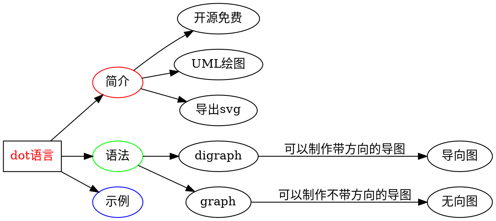
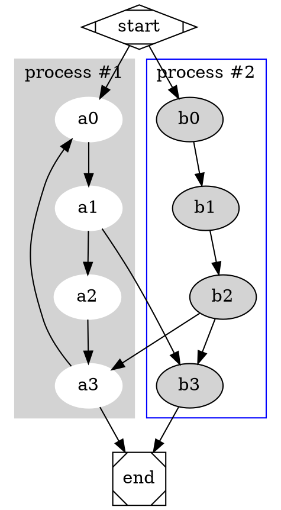
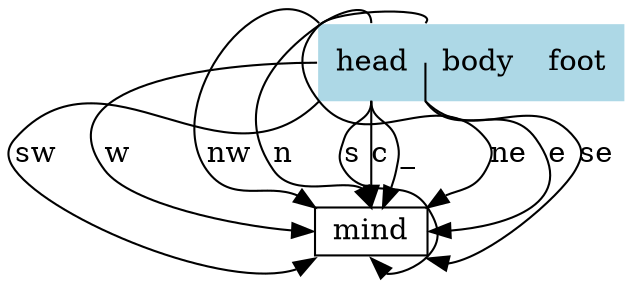
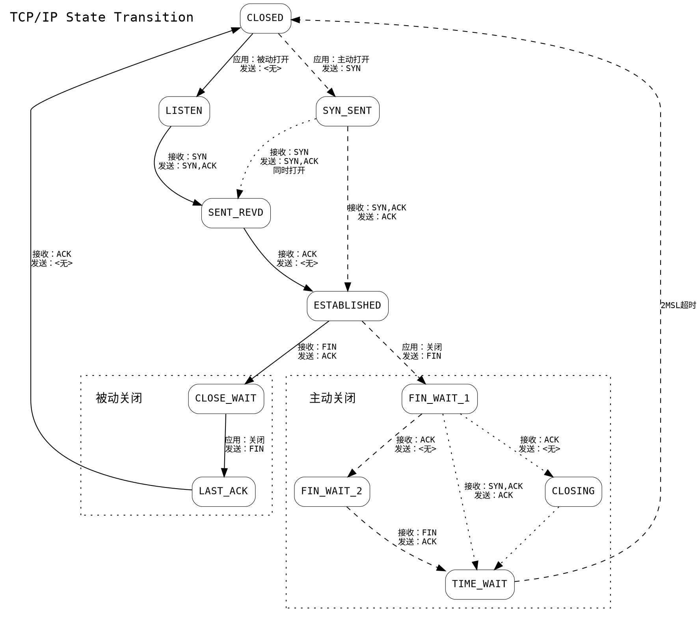
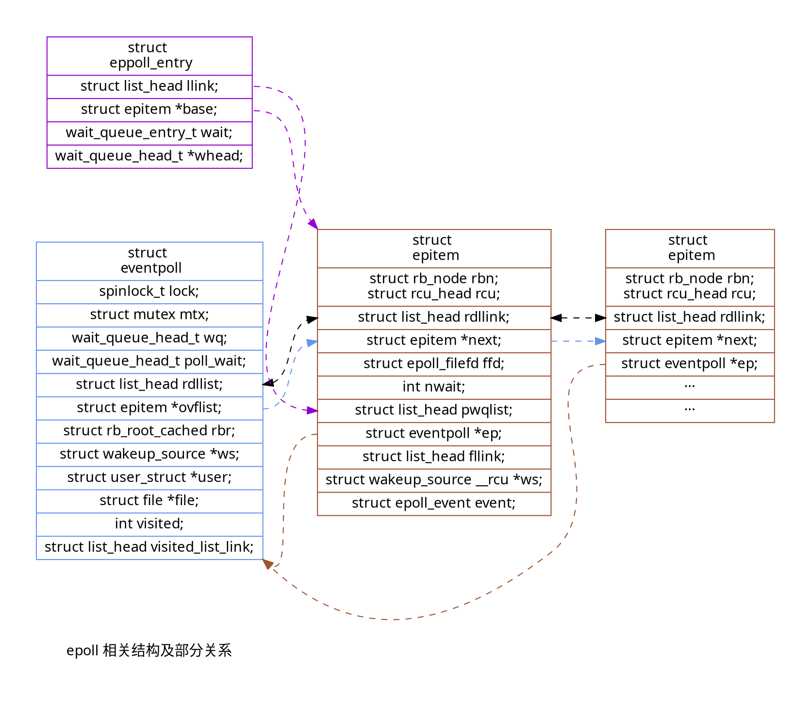
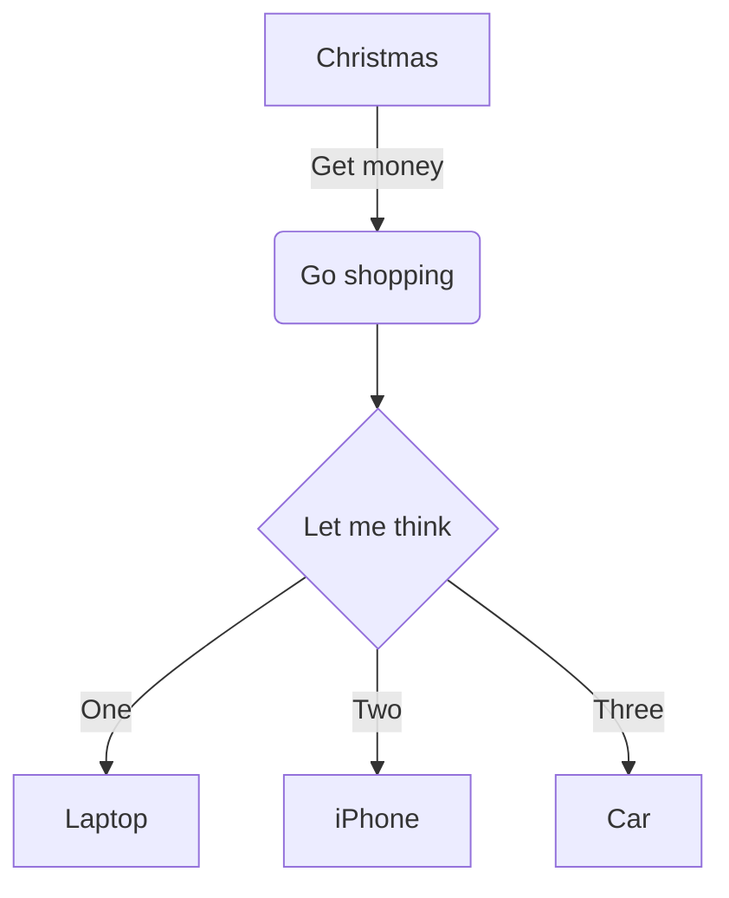
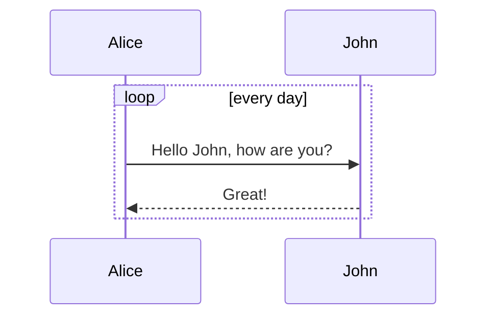
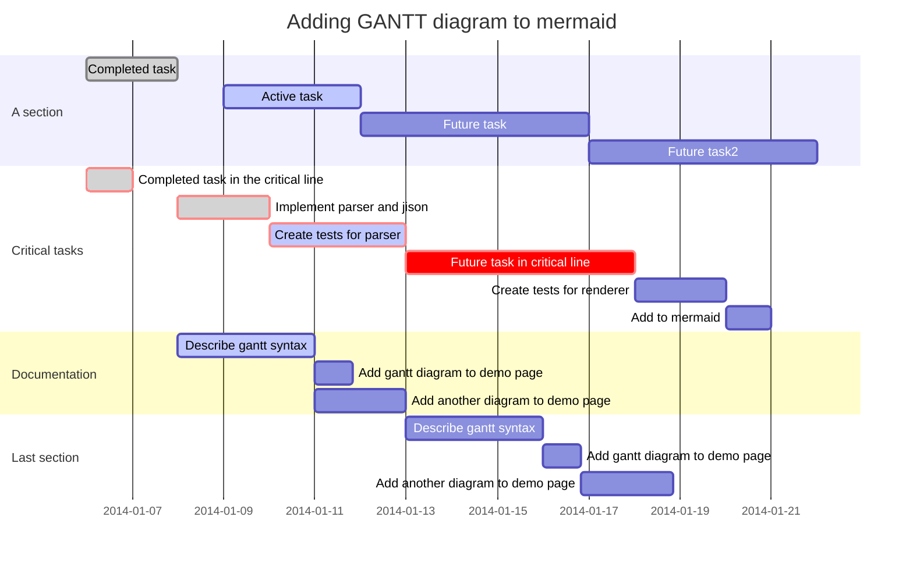
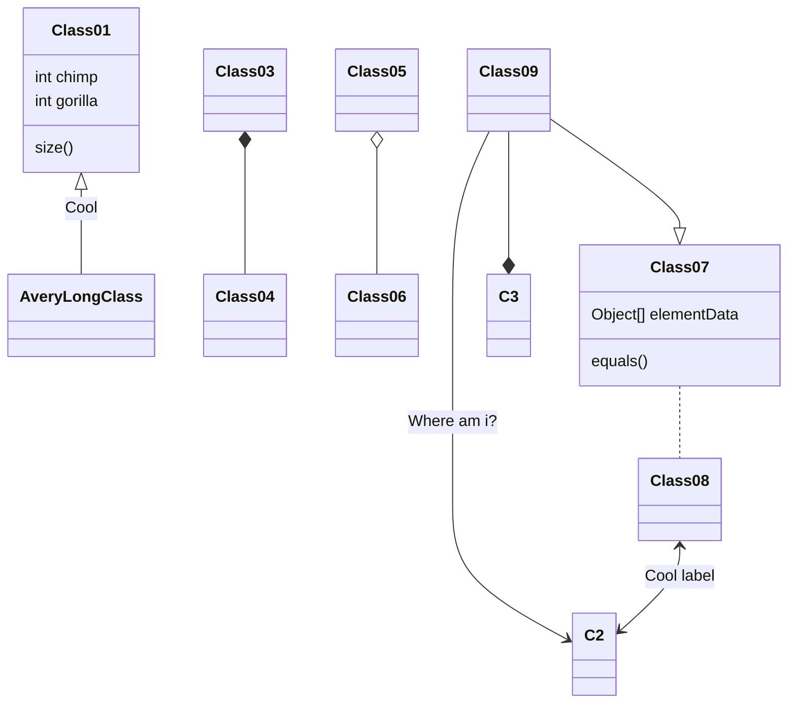

# Markdown Plus

Markdown Plus ("M+" or "mdp" for short) is a markdown editor with extra features.

## Apps

We currently **_don't_** accept donations.
The best way to support our development is to buy our apps.

### Markdown Plus

<a href="javascript:;"></a>
[Markdown Plus](javascript:;) is available for both OS X and Windows. You get every feature of the web version plus lots of advanced features.

### Markdown Mate

<a href="javascript:;"></a>
[Markdown Mate](javascript:;) is a markdown previewer, it's not going to replace your favorite editor but handles everything about markdown.

::: success
We provide email support to those who have purchased the apps: **service@TTTTT.com**
:::

---

# Table of Contents

[toc]

Note: Only `h2` and `h3` are shown in toc.

## Mastering Markdown

Markdown allows you to write using an easy-to-read, easy-to-write plain text format, which then converts to valid HTML for viewing.

[Mastering Markdown Guide](https://guides.github.com/features/mastering-markdown/).

## ~~strikethrough~~

## ++insert++

## ==mark==

## Subscript: H~2~O

You can also use inline math: `$H_2O$`

## Superscript: 29^th^

You can also use inline math: `$29^{th}$`

## Emoji: :panda_face: :sparkles: :camel: :boom: :pig:

[Emoji Cheat Sheet](http://www.emoji-cheat-sheet.com/)

## Fontawesome: :fa-cab: :fa-flag: :fa-bicycle: :fa-leaf: :fa-heart:

[All the Font Awesome icons](http://fontawesome.io/icons/)

## `print 'hello code'`

    evens = [1, 2, 3, 4, 5].collect do |item|
      item * 2
    end

```javascript
$(document).ready(() => {
    $("pre code").each((i, block) => {
        hljs.highlightBlock(block);
    });
});
```

[Code Formatting](https://help.github.com/articles/markdown-basics/#code-formatting)

## Tables and alignment

| First Header                | Second Header                |
| --------------------------- | ---------------------------- |
| Content from cell 1         | Content from cell 2          |
| Content in the first column | Content in the second column |

| Left-Aligned | Center Aligned  | Right Aligned |
| :----------- | :-------------: | ------------: |
| col 3 is     | some wordy text |        \$1600 |
| col 2 is     |    centered     |          \$12 |

[Table Syntax](https://help.github.com/articles/github-flavored-markdown/#tables)

## Task list

-   [ ] a bigger project
    -   [x] first subtask
    -   [x] follow up subtask
    -   [ ] final subtask
-   [ ] a separate task

[Task List Syntax](https://help.github.com/articles/writing-on-github/#task-lists)

## Abbreviation

Markup is based on [php markdown extra](https://michelf.ca/projects/php-markdown/extra/#abbr) definition, but without multiline support:

_[HTML]: Hyper Text Markup Language
_[W3C]: World Wide Web Consortium
The HTML specification
is maintained by the W3C.

## Footnote

Here is a footnote reference,[^1] and another.[^longnote]

[^1]: Here is the footnote.
[^longnote]: Here's one with multiple blocks.

    Subsequent paragraphs are indented to show that they

belong to the previous footnote.

Here is an inline note.^[Inlines notes are easier to write, since
you don't have to pick an identifier and move down to type the
note.]

[Footnote Syntax](http://pandoc.org/README.html#footnotes)

## Mathematical formula `$y = x^2$`

Inline math: `$\dfrac{ \tfrac{1}{2}[1-(\tfrac{1}{2})^n] }{ 1-\tfrac{1}{2} } = s_n$`.

Math block:

```katex
\oint_C x^3\, dx + 4y^2\, dy

2 = \left(
 \frac{\left(3-x\right) \times 2}{3-x}
 \right)

\sum_{m=1}^\infty\sum_{n=1}^\infty\frac{m^2\,n}
 {3^m\left(m\,3^n+n\,3^m\right)}

\phi_n(\kappa) =
 \frac{1}{4\pi^2\kappa^2} \int_0^\infty
 \frac{\sin(\kappa R)}{\kappa R}
 \frac{\partial}{\partial R}
 \left[R^2\frac{\partial D_n(R)}{\partial R}\right]\,dR
```

[Mathematical Formula Syntax](http://meta.wikimedia.org/wiki/Help:Displaying_a_formula)

## AsciiMath

Inline AsciiMath: `@(1/2[1-(1/2)^n])/(1-(1/2))=s_n@`

```AsciiMath
oint_Cx^3 dx+4y^2 dy

2=(((3-x)xx2)/(3-x))

sum_(m=1)^oosum_(n=1)^oo(m^2 n)/(3^m(m3^n+n3^m)
```

```ASCIIMath
phi_n(kappa) = 1/(4pi^2 kappa^2)
 int_0^oo (sin(kappa R))/(kappa R)
 del/(del R)
[R^2 (del D_n (R))/(del R)] del R
```

[AsciiMath Documentation](http://asciimath.org/)

## Graphviz

### Graphviz 思维导图




### Graphviz 流程图



### Graphviz action 图



### Graphviz TCP IP 状态流程图



### Graphviz epoll 相关数据结构及关系



---

## mermaid charts

### Flowchart



[Flowchart Syntax](http://knsv.github.io/mermaid/#flowcharts-basic-syntax)

::: warning
Adding many flowcharts will slow down the editor.
:::

### Sequence diagram



[Sequence Diagram Syntax](http://knsv.github.io/mermaid/#sequence-diagrams)

::: warning
Adding many sequence diagrams will slow down the editor.
:::

### Gantt diagram



[Gantt Diagram Syntax](http://knsv.github.io/mermaid/#gant-diagrams)

::: warning
Adding many gantt diagrams will slow down the editor.
:::

### Class diagram



Class diagram is powered by [mermaid](https://github.com/knsv/mermaid).

::: warning
Adding many class diagrams will slow down the editor.
:::

## Custom Container

Markup is similar to fenced code blocks. Valid container types are `success`, `info`, `warning` and `danger`.

::: info
You have new mail.
:::

::: danger
Staying up all night is bad for health.
:::

## Definition list

Term 1
~ Definition 1

Term 2
~ Definition 2a
~ Definition 2b

[Definition List Syntax](http://pandoc.org/README.html#definition-lists)

## HTML

If you find the markdown syntax too limited, you can try some <span style="color: blue;">HTML<span>:

<p style="text-align:center;"></p>

<a href="javascript:;" target="_blank"></a>

## Charts

[Documentation for charts](http://www.chartjs.org/docs/)

### Line Chart

```chart
{
  "type": "line",
  "data": {
    "labels": [
      "January",
      "February",
      "March",
      "April",
      "May",
      "June",
      "July"
    ],
    "datasets": [
      {
        "label": "# of bugs",
        "fill": false,
        "lineTension": 0.1,
        "backgroundColor": "rgba(75,192,192,0.4)",
        "borderColor": "rgba(75,192,192,1)",
        "borderCapStyle": "butt",
        "borderDash": [],
        "borderDashOffset": 0,
        "borderJoinStyle": "miter",
        "pointBorderColor": "rgba(75,192,192,1)",
        "pointBackgroundColor": "#fff",
        "pointBorderWidth": 1,
        "pointHoverRadius": 5,
        "pointHoverBackgroundColor": "rgba(75,192,192,1)",
        "pointHoverBorderColor": "rgba(220,220,220,1)",
        "pointHoverBorderWidth": 2,
        "pointRadius": 1,
        "pointHitRadius": 10,
        "data": [
          65,
          59,
          80,
          81,
          56,
          55,
          40
        ],
        "spanGaps": false
      }
    ]
  },
  "options": {}
}
```

<br/>

[Documentation for Line Chart](http://www.chartjs.org/docs/#line-chart)

### Bar Chart

```chart
{
  "type": "bar",
  "data": {
  "labels": [
    "Red",
    "Blue",
    "Yellow",
    "Green",
    "Purple",
    "Orange"
  ],
  "datasets": [
    {
    "label": "# of Votes",
    "data": [
      12,
      19,
      3,
      5,
      2,
      3
    ],
    "backgroundColor": [
      "rgba(255, 99, 132, 0.2)",
      "rgba(54, 162, 235, 0.2)",
      "rgba(255, 206, 86, 0.2)",
      "rgba(75, 192, 192, 0.2)",
      "rgba(153, 102, 255, 0.2)",
      "rgba(255, 159, 64, 0.2)"
    ],
    "borderColor": [
      "rgba(255,99,132,1)",
      "rgba(54, 162, 235, 1)",
      "rgba(255, 206, 86, 1)",
      "rgba(75, 192, 192, 1)",
      "rgba(153, 102, 255, 1)",
      "rgba(255, 159, 64, 1)"
    ],
    "borderWidth": 1
    }
  ]
  },
  "options": {}
}
```

<br/>

[Documentation for Bar Chart](http://www.chartjs.org/docs/#bar-chart)

### Radar Chart

```chart
{
  "type": "radar",
  "data": {
    "labels": [
      "Eating",
      "Drinking",
      "Sleeping",
      "Designing",
      "Coding",
      "Cycling",
      "Running"
    ],
    "datasets": [
      {
        "label": "My First dataset",
        "backgroundColor": "rgba(179,181,198,0.2)",
        "borderColor": "rgba(179,181,198,1)",
        "pointBackgroundColor": "rgba(179,181,198,1)",
        "pointBorderColor": "#fff",
        "pointHoverBackgroundColor": "#fff",
        "pointHoverBorderColor": "rgba(179,181,198,1)",
        "data": [
          65,
          59,
          90,
          81,
          56,
          55,
          40
        ]
      },
      {
        "label": "My Second dataset",
        "backgroundColor": "rgba(255,99,132,0.2)",
        "borderColor": "rgba(255,99,132,1)",
        "pointBackgroundColor": "rgba(255,99,132,1)",
        "pointBorderColor": "#fff",
        "pointHoverBackgroundColor": "#fff",
        "pointHoverBorderColor": "rgba(255,99,132,1)",
        "data": [
          28,
          48,
          40,
          19,
          96,
          27,
          100
        ]
      }
    ]
  },
  "options": {}
}
```

<br/>

[Documentation for Radar Chart](http://www.chartjs.org/docs/#radar-chart)

### Polar Area Chart

```chart
{
  "type": "polarArea",
  "data": {
    "datasets": [
      {
        "data": [
          11,
          16,
          7,
          3,
          14
        ],
        "backgroundColor": [
          "#FF6384",
          "#4BC0C0",
          "#FFCE56",
          "#E7E9ED",
          "#36A2EB"
        ],
        "label": "My dataset"
      }
    ],
    "labels": [
      "Red",
      "Green",
      "Yellow",
      "Grey",
      "Blue"
    ]
  },
  "options": {}
}
```

<br/>

[Documentation for Polar Area Chart](http://www.chartjs.org/docs/#polar-area-chart)

### Pie Chart

```chart
{
  "type": "pie",
  "data": {
    "labels": [
      "Red",
      "Blue",
      "Yellow"
    ],
    "datasets": [
      {
        "data": [
          300,
          50,
          100
        ],
        "backgroundColor": [
          "#FF6384",
          "#36A2EB",
          "#FFCE56"
        ],
        "hoverBackgroundColor": [
          "#FF6384",
          "#36A2EB",
          "#FFCE56"
        ]
      }
    ]
  },
  "options": {}
}
```

<br/>

[Documentation for Pie Chart](http://www.chartjs.org/docs/#doughnut-pie-chart)

### Doughnut Chart

```chart
{
  "type": "doughnut",
  "data": {
    "labels": [
      "Red",
      "Blue",
      "Yellow"
    ],
    "datasets": [
      {
        "data": [
          300,
          50,
          100
        ],
        "backgroundColor": [
          "#FF6384",
          "#36A2EB",
          "#FFCE56"
        ],
        "hoverBackgroundColor": [
          "#FF6384",
          "#36A2EB",
          "#FFCE56"
        ]
      }
    ]
  },
  "options": {}
}
```

<br/>

[Documentation for Doughnut Chart](http://www.chartjs.org/docs/#doughnut-pie-chart)

### Bubble Chart

```chart
{
  "type": "bubble",
  "data": {
    "datasets": [
      {
        "label": "First Dataset",
        "data": [
          {
            "x": 20,
            "y": 30,
            "r": 15
          },
          {
            "x": 40,
            "y": 10,
            "r": 10
          }
        ],
        "backgroundColor": "#FF6384",
        "hoverBackgroundColor": "#FF6384"
      }
    ]
  },
  "options": {}
}
```

<br/>

[Documentation for Bubble Chart](http://www.chartjs.org/docs/#bubble-chart)
